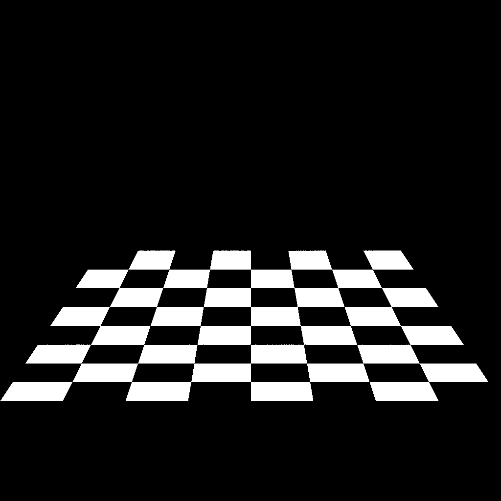

# Maray
JIT Ray Tracing using basic math



This image was rendered by Maray from "data/chess.maray".

To install:

`> cargo install --example maray maray`

To run:

`> maray --cpus 8 --input "data/chess.maray" --output "test.png"`

Shorthand version:

`> maray -c 8 -i "data/chess.maray" -o "test.png"`

### Textures

You can use `--textures` or `-t` to specify a list of images.

```text
> maray -c 8 -i "input.maray" -o "output.png" -t "texture0.png" "texture1.png"
```

Maray sets up a default runtime with functions for color channels (RGB)
and image width and height.

For the formula to get the `id` of a function, see the `textures` module.

When using Maray as a library, you can customize the runtime.

### Using Maray as a library

Maray has a Cargo default feature flag "render" which can be turned off.
This is useful when only needing the library to generate content.

### About Maray

Maray is a binary format for ray tracing scenes that uses basic math expressions.
It can be used for both 2D and 3D. The renderer uses Just-In-Time compiling (JIT) into WASM.

Maray can also be used as a Rust library to produce content for ray tracing or
to perform semantical analysis on math formulas.
Through the library, you can also render using Rayon and an interpreter,
which is approximately at least 10-20x slower than the JIT renderer.

The binary format serializes `maray::Expr` using [bincode](https://crates.io/crates/bincode),
with the size `[u32; 2]`, so the renderer knows the resolution of the image.
The format is designed to reproduce rendering exactly without
any additional parameters.
To change the size, you need to generate a new file.
The floating point precision is `f64` for high quality numeric precision.

### Features

Maray contains much less features than other ray tracing software.
In Maray, you build stuff using basic math, so you need an external
programming language or tool to produce the data.
However, besides this restriction, there are no limits on how people produce content.
Results are reproduced deterministically on all platforms and the code runs on
most hardware. Using basic math helps researchers build tools that work for
all content produced in Maray.

 Maray can be used as a Rust library:

- Produce binary files storing mathematical expressions
- Automatic compressor of math formula
- Render and export to PNG file
- Parallel rendering using Rayon and interpreter
- Parallel rendering using WASM and JIT by [wasmer](https://crates.io/crates/wasmer)
- `Semantics` trait for performing semantical analysis

When using Maray, it is common to inline everything first and use
automatic compression to reduce operations.

### Design

Maray has a very limited set of building blocks:

- `x` (X coordinate)
- `y` (Y coordinate)
- `τ` (tau = 2*𝜋)
- `𝐞` (Euler's constant)`
- `ℕ` (natural number constants)
- `-` (unary minus)
- `1/` (reciprocal, unary division)
- `abs` (absolute value)
- `sqrt` (square root)
- `step` (1 if >= 0, 0 otherwise)
- `sin` (sine)
- `exp` (𝐞^)
- `ln` (natural logarithm)
- `+` (addition)
- `*` (multiplication)
- `max` (maximum)
- `min` (minimum)
- `app` (call external function)

There are no loops or recursion, vectors, matrices built in.
To use a texture, see `Runtime`.

Maray supports variables, for example:

```text
x + a
where
  a = 2 + y
```

You can perform partial evaluation and automatic compression of a math formula
after inlining everything. This optimizes the formula for rendering.

One benefit of Maray is that researchers can perform semantical analysis on
expressions and build tools that works with all content produced in Maray.
